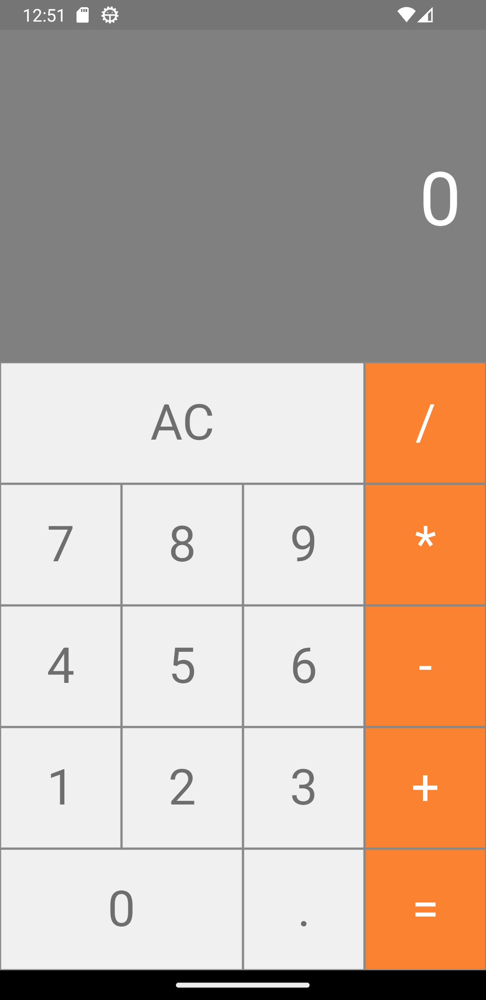

# Calculadora_START
 O App foi desenvolvido com intuito de obter experiência e aprendizado com React Native e JavaScript, ele pode
 fazer calculos básicos como adição, subtração, multiplicação e divisão com numeros
 naturais e racionais.

## Capturas de Tela

